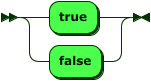

# Linguagem Binaria 


# Uso 
```bash
echo"01111011 comentario é livre 01100101011000110110100001101111001001110110100001100 desde que nao use numeros :) 101011011000110110001101111001000000111011101101111011100100110110001100100001001110011101101111101" > teste 
python3 compilador teste
```
out : hello world


## Caracteristicas da linguagem

- A linguagem apresenta como alfabeto somente 0 e 1.

- Para codar nesta linguagem você precisará de boa memoria e tera duas opções:
    - 1 - Utilizar um tradutor simutaneo(extenção no editor) como demonstrado nos gif's acima
        
    - 2 - Ter uma tabela ascii e paciência de ir traduzindo seu codigo para zeros e uns

    

Alem disso é importante saber a estrutura para a tradução
## Exemplo da estrutura
```PHP 
{
    // nome de função @qualquercoisa@
function @soma@($x,$y){
    // variaveis somente uma letra
    $a=$x+$y;
    echo $a;
    return $a;
}
$a=readline();
// numero tem este formato $a = :4:;
$b=@soma@($a,:4:);
// string entre aspas -  ex de concatenação com o .
echo 'resultado = '.$b;
// boolean somente minusculo $b = true or false;
// while,if,else  <- normal 

}
```

### Para codar basta traduzir os caracteries acima para o correspondente na tabela ascii para binario.

# Ebnf e DS
----
BLOCK:


`                                `

[BLOCK](#BLOCK "BLOCK")    ::= '{' [COMMAND](#COMMAND "COMMAND") '}'

referenced by:

-   [COMMAND](#COMMAND "COMMAND")
---
COMMAND:


`                                `

[COMMAND](#COMMAND "COMMAND")  ::= ( ( [Iden](#Iden "Iden") '=' | 'return' ) [RELEXPR](#RELEXPR "RELEXPR") | ( 'return' | 'echo' [RELEXPR](#RELEXPR "RELEXPR") ) ';' | [nome](#nome "nome") '(' ( [RELEXPR](#RELEXPR "RELEXPR") ( ',' [RELEXPR](#RELEXPR "RELEXPR") )\* )? ')' )? ';'

           | ( 'function' [nome](#nome "nome") '(' ( [Iden](#Iden "Iden") ( ',' [Iden](#Iden "Iden") )\* )? ')' )? [BLOCK](#BLOCK "BLOCK")

           | ( 'while' '(' [RELEXPR](#RELEXPR "RELEXPR") ')' | 'if' '(' [RELEXPR](#RELEXPR "RELEXPR") ')' ( [COMMAND](#COMMAND "COMMAND") 'else' )? ) [COMMAND](#COMMAND "COMMAND")

referenced by:

-   [BLOCK](#BLOCK "BLOCK")
-   [COMMAND](#COMMAND "COMMAND")

---

Iden:


`                                `

[Iden](#Iden "Iden")     ::= '\$' [a-zA-Z]

referenced by:

-   [ASSIGNMENT](#ASSIGNMENT "ASSIGNMENT")
-   [COMMAND](#COMMAND "COMMAND")
-   [FACTOR](#FACTOR "FACTOR")

---

RELEXPR:


`                                `

[RELEXPR](#RELEXPR "RELEXPR")  ::= [EXPRESSION](#EXPRESSION "EXPRESSION") ( ( '==' | '\<' | '\>' ) [EXPRESSION](#EXPRESSION "EXPRESSION") )\*

referenced by:

-   [COMMAND](#COMMAND "COMMAND")
-   [FACTOR](#FACTOR "FACTOR")

---

EXPRESSION:


`                                `

[EXPRESSION](#EXPRESSION "EXPRESSION")

         ::= [TERM](#TERM "TERM") ( ( '+' | '-' | '|' ) [TERM](#TERM "TERM") )\*

referenced by:

-   [ASSIGNMENT](#ASSIGNMENT "ASSIGNMENT")
-   [RELEXPR](#RELEXPR "RELEXPR")

---

TERM:


`                                `

[TERM](#TERM "TERM")     ::= [FACTOR](#FACTOR "FACTOR") ( ( '\*' | '/' | '&&' ) [FACTOR](#FACTOR "FACTOR") )\*

referenced by:

-   [EXPRESSION](#EXPRESSION "EXPRESSION")

---

FACTOR:


`                                `

[FACTOR](#FACTOR "FACTOR")   ::= ( '!' | '+' | '-' )\* ( ( '(' [RELEXPR](#RELEXPR "RELEXPR") | 'readline' '(' | [nome](#nome "nome") '(' ( [RELEXPR](#RELEXPR "RELEXPR") ( ',' [RELEXPR](#RELEXPR "RELEXPR") )\* )? ) ')' | [Iden](#Iden "Iden") )? ';'

           | [Number](#Number "Number")

           | [bolean](#bolean "bolean")

           | ' string\_ '

referenced by:

-   [TERM](#TERM "TERM")

---

ASSIGNMENT:


`                                `

[ASSIGNMENT](#ASSIGNMENT "ASSIGNMENT")

         ::= [Iden](#Iden "Iden") '=' [EXPRESSION](#EXPRESSION "EXPRESSION") ';'

no references

nome:


`                                `

[nome](#nome "nome")     ::= '@' [a-zA-Z] '@'

referenced by:

-   [COMMAND](#COMMAND "COMMAND")
-   [FACTOR](#FACTOR "FACTOR")

---

bolean:



`                                `

[bolean](#bolean "bolean")   ::= 'true'

           | 'false'

referenced by:

-   [FACTOR](#FACTOR "FACTOR")

* * * * *

# Desvantagens e Vantagens

- # Vantagens 
    -  ## Seu código é ilegivel(poderia codar algo secreto em lugares publicos). 

    - ## Em um caso hipotético seria possivel codar somente com dois botões

- # Desvantagens 
    - # Não é muito prática(uso em casos muito especificos).

    - # Depois de um tempo pode ficar meio louco de tantos 101010

# Melhorias futuras  :+1:

- [?] Extensão para tradução automatica 
- [X] Comentario no codigo.
- [ ]  Implementar na linguagem outras funcionalidades como Raise, etc...
- [ ] Gerar o assembly e o executavel do programa


